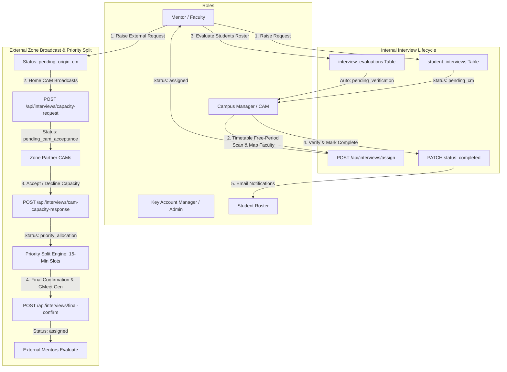
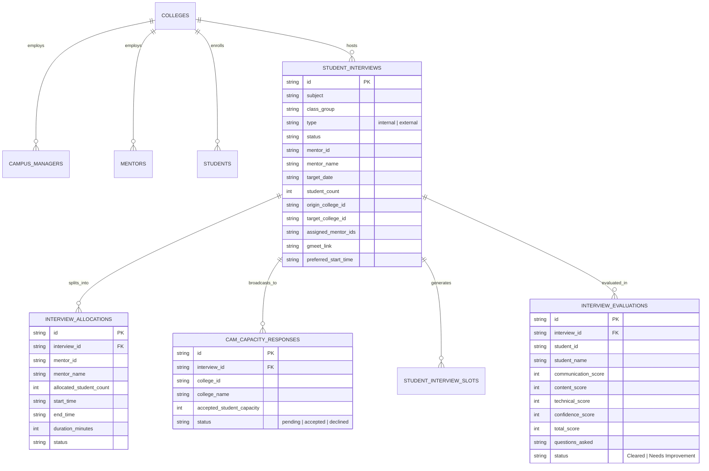
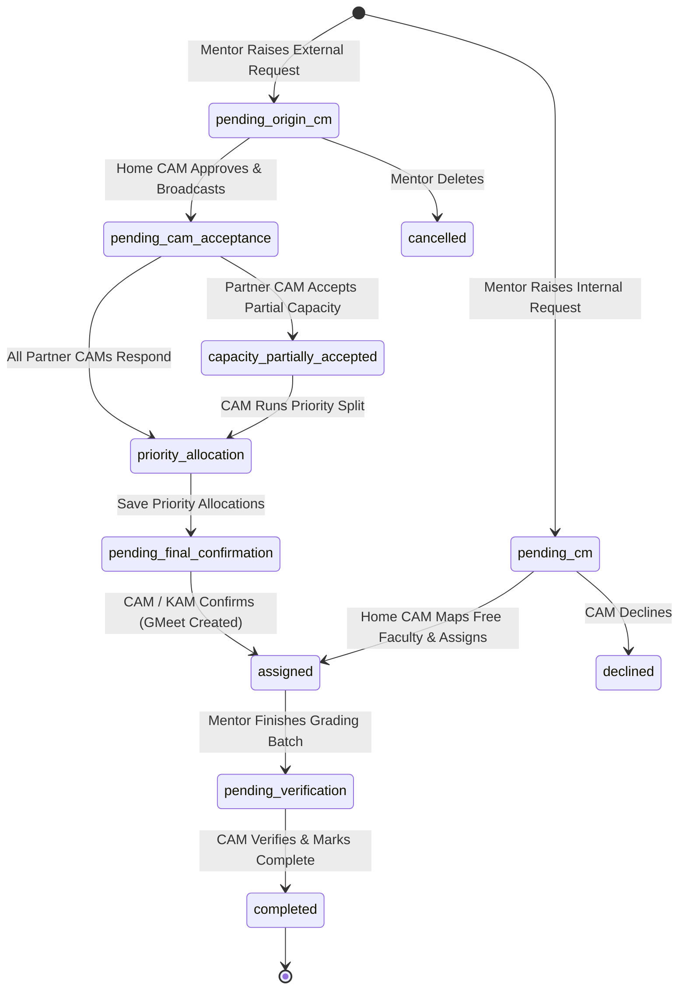

# Interview Module: Architecture, Lifecycle & Logic Specification

## 1. Executive Summary

The **Interview Module** in the FacePrep E-Campus Timetable & Operations platform is an end-to-end evaluation and cross-campus scheduling engine. It supports both **Internal Campus Sessions** (evaluated by in-house faculty during timetable free periods) and **External Regional Zone Sessions** (evaluated across partner institutions in the regional KAM cluster via automated Google Meet links, 15-minute slot splits, and cross-campus capacity broadcast).

---

## 2. System Architecture & Role Matrix

### Role Capabilities Table

| Role | Permissions & Actions |
| :--- | :--- |
| **Faculty Mentor** | • Raise Internal/External interview requests for assigned subjects (Tamil excluded). • View assigned interview sessions on calendar and session roster. • Grade assigned student batches (15-min structured questions, 4 core skill sliders, attendance, remarks). |
| **Campus Manager (CAM)** | • Review pending requests for their campus. • Scan live master timetable for free periods on target weekday. • Map faculty individually or in bulk with auto-capacity calculations. • Broadcast external requests to zone partner campuses in KAM cluster. • Accept/Decline incoming capacity requests from other partner campuses. • Verify evaluations and mark sessions as completed. |
| **Key Account Manager (KAM) / Super Admin** | • Regional cluster-wide visibility across all partner campuses. • Monitor cross-campus acceptance matrices and capacity fulfillment. • Trigger and approve priority split allocations. • View all active and completed sessions on regional calendar. |
| **Student** | • View evaluated marks, score breakdowns, and rubrics on portal. • Receive automated email notifications when results are verified. |

---

## 3. Database Schema Overview

---

## 4. End-to-End Workflow & Status Transitions

### Complete Status State Machine

---

## 5. Core Logic Components

### A. Live Timetable Free-Period Detection
- **Target Day Resolution**: Evaluates `target_date` into the day of the week (e.g. `2026-08-14` -> `Friday`).
- **Busy Period Scan**: Queries `slots` table for `mentorId = m.id AND day = targetDay`.
- **Free Period Deduction**: Subtracts busy hours from standard periods (`8.20 AM - 9.10 AM`, `9.10 AM - 10.00 AM`, `10.20 AM - 11.10 AM`, `11.10 AM - 12.00 PM`, `12.00 PM - 12.50 PM`, `02:00 PM - 03:00 PM`, `03:00 PM - 04:00 PM`).
- **Dynamic Feedback**: Displays interactive free period pills and badges:
  - `✓ Free in <slot>` (Emerald)
  - `Busy in <slot>` (Amber)
  - `Fully Booked Today` (Rose)

### B. Flexible Switching Architecture
1. **Global Time Slot Switch**: Top dropdown scans the whole campus and auto-selects all faculty free at that hour.
2. **Individual Mentor Slot Switch**: Clicking a mentor's free period button or opening their drawer assigns **only that mentor's slot** without affecting other selected mentors.
3. **Student Batch Allocation**: Calculates individual student batches per mentor (1 slot of 50m / 15m ≈ 3 students) and auto-sums total capacity.
4. **Scope Switch**: Toggle between `Subject Faculty` and `All Campus Faculty`.

### C. Student Roster Batch Scoping
- Evaluator roster displays **only the assigned batch count** starting from index 0 of the department roster (`listToSlice.slice(0, assignedCount)`), ensuring mentors evaluate exactly their assigned quota (e.g. 10 students instead of the whole 47-student class).

### D. Priority Split & Cascade Engine (External Evaluation)
- Multi-college capacity aggregator that splits large student cohorts across multiple partner campus faculty.
- Generates precise, non-overlapping 15-minute evaluation segments with cascading overflow handling.

---

## 6. API Route Catalog

| Endpoint | Method | Purpose |
| :--- | :---: | :--- |
| `/api/interviews` | `GET` | Fetches role-scoped interview requests and evaluations. |
| `/api/interviews` | `POST` | Raises a new Internal or External interview session. |
| `/api/interviews` | `PATCH` | Updates session status (e.g., marks completed and triggers student emails). |
| `/api/interviews` | `DELETE` | Deletes an interview request with full cascade across all related child tables (supports `?all=true`). |
| `/api/interviews/capacity-request` | `POST` | Broadcasts external request to all partner colleges in the KAM region. |
| `/api/interviews/cam-capacity-response` | `POST` | Records partner campus acceptance or decline with accepted student capacity. |
| `/api/interviews/priority-split` | `POST` | Previews and persists optimal 15-minute slot splits across partner campuses. |
| `/api/interviews/final-confirm` | `POST` | Confirms priority allocation, generates live GMeet link, and creates 15-minute student slot records. |
| `/api/interviews/assign` | `POST` | Saves home CAM faculty mapping, individual time slots, and dispatches mentor emails. |
| `/api/interviews/evaluate` | `POST` | Saves per-student scores, core skill sliders, rubric questions, remarks, and auto-completes evaluation. |

---

## 7. Verification Summary

- **TypeScript Compilation**: `npx tsc --noEmit` verified with 0 errors.
- **Database Synchronization**: Pure database-backed colleges, mentors, students, and timetable slots.
- **Cascade Cleanups**: Tested and verified table reset and individual record lifecycle.
