# KAM Executive Portal — Gap Analysis & Regional Analytics Blueprint
> **Architectural Specification: Bridging the Visibility & Governance Gap between CM, Mentor, Student Portals, and Executive KAM**  
> *Last Updated: August 2026*

---

## 🎯 Executive Philosophy: Visibility & Analytics vs Actionable Transactions

```
┌──────────────────────────────────────────────────────────────────────────────────┐
│                             CORE ARCHITECTURAL RULE                              │
├──────────────────────────────────────────────────────────────────────────────────┤
│ KAM is an Executive Governance & Intelligence Layer, NOT a Transactional Engine │
│                                                                                  │
│ • CM / CAM   → Configures, schedules, coordinates, and approves campus operations│
│ • Mentor     → Marks attendance, delivers syllabus, grades tasks, evaluates demo │
│ • Student    → Attends classes, submits lab code, takes exams, applies for leaves│
│                                                                                  │
│ 🔑 KAM INHERITS: Regional aggregation, cross-campus visibility, SLA compliance,  │
│                  completion percentages, and predictive risk stratification.     │
│ 🚫 KAM DOES NOT: Mark attendance, grade tasks, upload PDFs, record cash fees,    │
│                  or process individual routine approvals.                        │
└──────────────────────────────────────────────────────────────────────────────────┘
```

---

## 📊 Summary of Identified KAM Gaps

```mermaid
graph TD
    subgraph "CURRENT KAM PORTAL"
        K1[Attendance Matrix & Compliance Donut]
        K2[Timetable Master Explorer]
        K3[Faculty Workload Ledger - 20h Target]
        K4[Student & Mentor 360 Profiles]
        K5[Mock Interviews & GMeet Export]
        K6[Handover Audit Ledger]
    end

    subgraph "🔴 10 MUST-ADD EXECUTIVE ANALYTICS MODULES"
        G1[1. Academic Delivery & Syllabus Pacing]
        G2[2. Multi-Dimensional Student Academic Risk]
        G3[3. Practical Lab / Skill Progress]
        G4[4. Faculty Daily Attendance & Punch Analytics]
        G5[5. Faculty Leave & Coverage Heatmap]
        G6[6. Regional Student Leave & OD Monitoring]
        G7[7. Portfolio Fee Collection & Dues Analytics]
        G8[8. Student Feedback & Issue Ticketing Heatmap]
        G9[9. SME Demo Teaching Performance]
        G10[10. Regional Academic Events Calendar]
    end

    K1 -.-> G2
    K3 -.-> G4
    K3 -.-> G5
    K6 -.-> G5
```



---

# 1. 📚 Gap 1: Academic Delivery & Syllabus Pacing Tracker (`academic_tracker`)

### Why It's Missing:
Mentors log completed topics and teaching hours; CAMs monitor campus delivery. However, KAM currently has **zero visibility into whether the syllabus is on track across campuses**.

### 💡 KAM Blueprint Specification:
```text
┌────────────────────────────────────────────────────────────────────────────────────────┐
│  PORTFOLIO SYLLABUS DELIVERY STATUS                                                    │
├──────────────────┬──────────────────┬─────────────────┬───────────────┬────────────────┤
│ Campus           │ Target Syllabus  │ Actual Covered  │ Delivery Gap  │ Delivery Pace  │
├──────────────────┼──────────────────┼─────────────────┼───────────────┼────────────────┤
│ SDNB Vaishnav    │ 75%              │ 78%             │ +3%           │ 🟢 On Track    │
│ Kamaraj Campus   │ 75%              │ 66%             │ -9% ⚠️        │ 🔴 Lagging     │
│ Main Campus      │ 75%              │ 74%             │ -1%           │ 🟢 Normal      │
└──────────────────┴──────────────────┴─────────────────┴───────────────┴────────────────┘
```
- **Hierarchical Drilldown**: Campus $\rightarrow$ Department $\rightarrow$ Batch $\rightarrow$ Subject $\rightarrow$ Mentor.
- **Teaching Hours Audit**: Expected lecture hours vs actual delivered hours completed.
- **Early Warning SLA**: Flags subjects lagging by $>10\%$ against the academic calendar deadline.

---

# 2. 🧠 Gap 2: Multi-Dimensional Student Academic Performance Index

### Why It's Missing:
The existing KAM Risk Stratification only evaluates **Attendance Shortage ($<75\%$)**. A student with $85\%$ attendance might be failing CIA exams, missing lab practicals, and unprepared for interviews.

### 💡 KAM Blueprint Specification:
Combine all academic vectors into an **Overall Student Academic Health Score**:

$$\text{Academic Risk Index} = w_1(\text{Att}) + w_2(\text{CIA 1\&2}) + w_3(\text{Lab Tasks}) + w_4(\text{Interview}) + w_5(\text{HireScore})$$

```text
┌────────────────────────────────────────────────────────────────────────────────────────┐
│  STUDENT ACADEMIC RISK MATRIX (Holistic 360°)                                          │
├───────────────┬────────────┬──────────┬───────────┬──────────────┬───────────┬─────────┤
│ Student Name  │ Attendance │ CIA Avg  │ Lab Tasks │ Interview RD │ HireScore │ Risk    │
├───────────────┼────────────┼──────────┼───────────┼──────────────┼───────────┼─────────┤
│ Vignesh R     │ 68% (Low)  │ 42%      │ 55%       │ 41/100       │ 52/100    │ 🔴 HIGH │
│ Ananya S      │ 92% (Good) │ 84%      │ 95%       │ 88/100       │ 85/100    │ 🟢 LOW  │
│ Karthik M     │ 88% (Good) │ 48% (Low)│ 40% (Low) │ 50/100       │ 58/100    │ 🟡 MED  │
└───────────────┴────────────┴──────────┴───────────┴──────────────┴───────────┴─────────┘
```
- Filters students who have good attendance but poor academic deliverables.
- Departmental & cohort academic averages.

---

# 3. 💻 Gap 3: Practical Skill / Lab Task Progress (`weekly_tasks`, `student_tracker`)

### Why It's Missing:
Mentors create coding assignments and verify student code repositories. KAM cannot currently track regional lab completion rates.

### 💡 KAM Blueprint Specification:
```text
┌────────────────────────────────────────────────────────────────────────────────────────┐
│  REGIONAL SKILL & PRACTICAL LAB PORTFOLIO OVERVIEW                                     │
├─────────────────────┬──────────────┬───────────────┬──────────────┬────────────────────┤
│ Total Tasks Issued  │ Submitted    │ Verified      │ Rework Req.  │ Regional Comp. Rate│
│ 1,240               │ 1,082 (87%)  │ 924 (75%)     │ 108 (9%)     │ 87.3%              │
└─────────────────────┴──────────────┴───────────────┴──────────────┴────────────────────┘
```
- **Campus Comparison Table**: Practical submission rate per college.
- **Verification Bottleneck Detection**: Identifies mentors who have pending unverified submissions $>7$ days old.

---

# 4. ⏰ Gap 4: Faculty Daily Attendance & Biometric Punch Analytics (`mentor_attendance`)

### Why It's Missing:
Faculty punch in daily (with a 30-minute opening deadline). CAMs handle late punch requests. KAM currently has **no visibility into whether faculty actually show up on time across institutions**.

### 💡 KAM Blueprint Specification:
```text
┌────────────────────────────────────────────────────────────────────────────────────────┐
│  FACULTY ATTENDANCE & PUNCH HEALTH                                                     │
├──────────────────┬─────────────────┬───────────┬───────────────┬───────────────────────┤
│ Campus           │ Today's Pres. % │ On Leave  │ Late Punches  │ Unmarked / Missing    │
├──────────────────┼─────────────────┼───────────┼───────────────┼───────────────────────┤
│ SDNB Vaishnav    │ 96% (24/25)     │ 1 Mentor  │ 0             │ 0                     │
│ Kamaraj Campus   │ 82% (14/17) ⚠️  │ 2 Mentors │ 3 Late        │ 1 Missing             │
└──────────────────┴─────────────────┴───────────┴───────────────┴───────────────────────┘
```
- **Late Punch Frequency**: Flags mentors who frequently miss the 30-minute campus start window.
- **Zero Action Burden**: KAM views trends and alerts; CAM handles daily approvals.

---

# 5. 🏖️ Gap 5: Faculty Leave & Coverage Heatmap (`faculty_leave_requests`, `leave_balances`)

### Why It's Missing:
Faculty submit leaves, and CAMs approve them. KAM needs to ensure that **upcoming leaves do not cause unstaffed classroom blackouts**.

### 💡 KAM Blueprint Specification:
```text
┌────────────────────────────────────────────────────────────────────────────────────────┐
│  UPCOMING FACULTY LEAVE & SUBSTITUTION COVERAGE (Next 14 Days)                         │
├──────────────────┬─────────────────┬───────────────────┬───────────────┬───────────────┤
│ Faculty Member   │ Campus          │ Leave Dates       │ Category      │ Coverage Stat │
├──────────────────┼─────────────────┼───────────────────┼───────────────┼────────────────┤
│ Dr. Ramesh K     │ SDNB Vaishnav   │ 25-Aug → 27-Aug   │ Casual (CL)   │ 🟢 Covered     │
│ Prof. Anita M    │ Kamaraj Campus  │ 28-Aug → 30-Aug   │ On-Duty (OD)  │ 🔴 Unassigned │
└──────────────────┴─────────────────┴───────────────────┴───────────────┴───────────────┘
```
- Cross-connects with the existing **Faculty Workload Ledger** and **Approved Handovers** to ensure zero uncovered sessions.

---

# 6. 📝 Gap 6: Regional Student Leave & On-Duty (OD) Monitoring (`leave_requests`)

### Why It's Missing:
Students apply for Medical/Casual leave and OD for symposiums/sports. KAM needs to monitor if sudden drops in attendance are due to unexcused absences or authorized OD spikes.

### 💡 KAM Blueprint Specification:
- **Daily Portfolio Absence Breakdown**:
  - `Total Students Absent Today = Unexcused Absences + Authorized Leave + Approved OD`.
- **Campus OD Volatility Index**: Flags campuses where excessive OD permissions are masking poor actual classroom attendance.

---

# 7. 💰 Gap 7: Portfolio Fee Collection & Financial Analytics (`student_fees`, `fee_payments`)

### Why It's Missing:
Student tuition and exam fees are recorded by CAM / Fee Manager. KAM has **no portfolio revenue analytics** to present to college trustees or management.

### 💡 KAM Blueprint Specification:
```text
┌────────────────────────────────────────────────────────────────────────────────────────┐
│  REGIONAL FEE COLLECTION & REVENUE LEDGER                                              │
├──────────────────┬─────────────────┬───────────────────┬───────────────┬───────────────┤
│ Total Portfolio  │ Collected (YTD) │ Outstanding Dues  │ Collection %  │ Overdue >30d  │
│ ₹ 2.40 Cr        │ ₹ 2.05 Cr       │ ₹ 35.00 Lakhs     │ 85.4%         │ ₹ 12.50 Lakhs │
└──────────────────┴─────────────────┴───────────────────┴───────────────┴───────────────┘
```
- **Campus Breakdown**: Collection rate % per institution.
- **Departmental Split**: Which batches have the highest unpaid tuition backlog.
- **Downloadable Financial Audit**: Excel export of institutional recovery rates.

---

# 8. 🎫 Gap 8: Student Feedback & Campus Issues Heatmap (`feedback_reports`, `campus_issues`)

### Why It's Missing:
Students report grievances and facility bugs. KAM needs a high-level **sentiment and issue ageing tracker**.

### 💡 KAM Blueprint Specification:
```text
┌────────────────────────────────────────────────────────────────────────────────────────┐
│  PORTFOLIO ISSUE RESOLUTION & SLA HEATMAP                                              │
├──────────────────┬─────────────────┬───────────────────┬───────────────┬───────────────┤
│ Category         │ Open Issues     │ Avg Resolution    │ Escalated >48h│ Critical Risk │
├──────────────────┼─────────────────┼───────────────────┼───────────────┼───────────────┤
│ Academic / Pace  │ 12              │ 1.8 Days          │ 2             │ 🟡 Medium     │
│ Faculty / Staff  │ 8               │ 3.2 Days          │ 3 ⚠️          │ 🔴 High       │
│ Timetable Clash  │ 5               │ 0.8 Days          │ 0             │ 🟢 Low        │
│ Infrastructure   │ 9               │ 4.5 Days          │ 4 ⚠️          │ 🔴 High       │
└──────────────────┴─────────────────┴───────────────────┴───────────────┴───────────────┘
```

---

# 9. 🎙️ Gap 9: SME Demo Teaching Session Governance (`demo_sessions`, `demo_rules`)

### Why It's Missing:
SME heads conduct weekly demo teaching evaluations for instructors. KAM needs to monitor **Faculty Teaching Quality Scores**.

### 💡 KAM Blueprint Specification:
- **Regional Demo Quota Compliance**: Scheduled vs Conducted vs Missed Demo Sessions per week.
- **Faculty Quality Benchmark**: Average demo evaluation score per subject group ($<70\%$ triggers SME intervention).

---

# 10. 🎪 Gap 10: Regional Academic Events & Hackathons Calendar (`academic_events`)

### Why It's Missing:
CAMs schedule hackathons, coding fests, and workshops. KAM needs a **consolidated regional calendar** to coordinate cross-campus participation.

### 💡 KAM Blueprint Specification:
- **Regional Calendar Timeline**: Upcoming hackathons, coding competitions, guest lectures, and placement drives across all supervised colleges.
- **Participation Metrics**: Number of student registrations per campus.

---

## 🏗️ Comprehensive Implementation Priority Matrix

| Phase | Module | Target Table | Primary KAM Capability |
| :--- | :--- | :--- | :--- |
| **Phase 1 (Immediate)** | **Academic Delivery Tracker** | `academic_tracker` | Syllabus progress vs target calendar deadline |
| **Phase 1 (Immediate)** | **Holistic Academic Risk Index** | Composite Index | Multi-vector student risk (Att + CIA + Tasks + HireScore) |
| **Phase 1 (Immediate)** | **Faculty Attendance & Punch Analytics** | `mentor_attendance` | Daily faculty presence %, late punch frequency |
| **Phase 2 (High)** | **Practical Task & Skill Progress** | `weekly_tasks`, `student_tracker`| Lab submission rates & mentor grading bottlenecks |
| **Phase 2 (High)** | **Faculty Leave & Coverage Radar** | `faculty_leave_requests` | 14-day upcoming leave schedule & cover assignments |
| **Phase 2 (High)** | **Portfolio Fee Analytics** | `student_fees`, `fee_payments` | Regional collection rates, outstanding dues & ageing |
| **Phase 3 (Medium)** | **Student Leave & OD Volatility** | `leave_requests` | Authorized OD vs unexcused absence trends |
| **Phase 3 (Medium)** | **Student Feedback / Issue Heatmap**| `feedback_reports`, `campus_issues`| Category-wise grievances & resolution SLA tracking |
| **Phase 3 (Medium)** | **SME Demo Quality Dashboard** | `demo_sessions` | Faculty demo compliance & average quality scores |
| **Phase 3 (Medium)** | **Regional Academic Events Hub** | `academic_events` | Cross-campus hackathon, fest & placement calendar |

---

## 🚫 Non-Goals for KAM (Explicit Boundary Definitions)

To maintain clean separation of concerns and avoid UI bloat:
1. **No Direct Attendance Entry**: KAM never marks student or faculty attendance.
2. **No Lab Code Grading**: KAM never grades student GitHub repositories.
3. **No Routine Leave Approvals**: Regular student and faculty leaves remain with Class Advisors and CAMs (only escalated emergency substitutions appear for KAM).
4. **No Financial Cashier Actions**: KAM never records cash/cheque receipts (handled by CAM/Fee Manager).
5. **No Timetable Grid Modification**: KAM observes conflicts and coverage; CAM edits the timetable grid.
