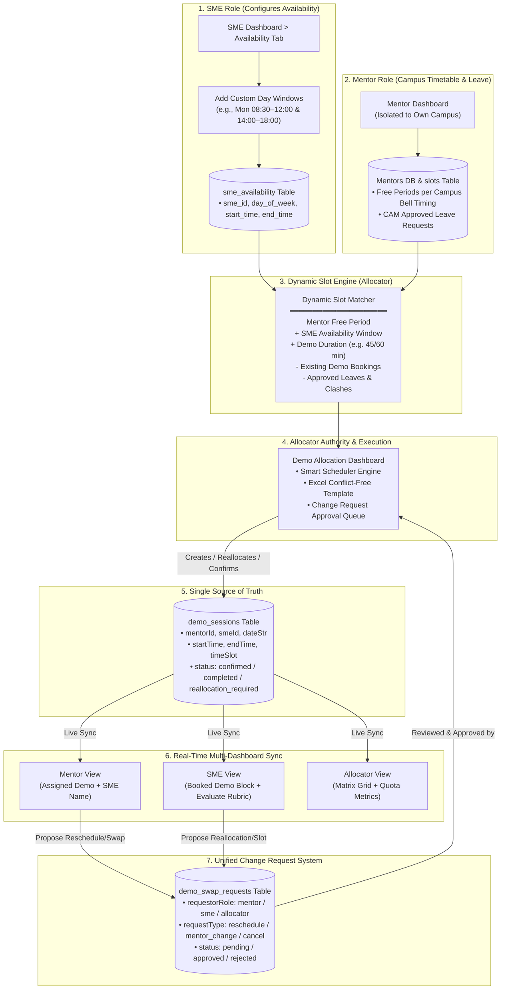

# Demo Allocation System: Dynamic Availability & Scheduling Architecture

## 1. System Architecture Diagram



---

## 2. What We Keep vs. What We Upgrade

| Component | Status | Purpose / Improvement |
| :--- | :---: | :--- |
| **`demo_sessions`** | **KEEP (Enhance)** | Single source of truth. Adds `start_time` & `end_time` alongside `timeSlot`. |
| **`demo_swap_requests`** | **KEEP (Enhance)** | Unified change-request queue (`reschedule`, `mentor_change`, `swap`, `cancel`). |
| **Three Dashboards** | **KEEP** | `DemoAllocationDashboard.tsx`, `SMEDashboard.tsx`, and `MentorDashboard.tsx`. |
| **Campus Timetable Isolation** | **KEEP** | Mentors evaluate free periods strictly against their own campus bell schedule. |
| **Rubric Evaluation (10-Criteria)**| **KEEP** | Comprehensive performance evaluation by SMEs. |
| **SME Availability Model** | **UPGRADE** | Remove fixed 9–5:30 assumption; add `sme_availability` multi-window table. |
| **Slot Matrix Engine** | **UPGRADE** | Replace hardcoded hourly matrix with dynamic interval slot calculation. |
| **Change Authority** | **KEEP / STRICT** | Mentors & SMEs submit requests; Allocator has final approval authority. |

---

## 3. Database Schema

### 1. `sme_availability` (New Dynamic Multi-Window Table)
```sql
CREATE TABLE IF NOT EXISTS sme_availability (
  id TEXT PRIMARY KEY,
  sme_id TEXT NOT NULL,
  day_of_week TEXT NOT NULL,       -- 'Monday', 'Tuesday', ...
  start_time TEXT NOT NULL,        -- '08:30' or '08:30 AM'
  end_time TEXT NOT NULL,          -- '12:00' or '12:00 PM'
  is_active INTEGER DEFAULT 1,
  created_at TEXT,
  updated_at TEXT,
  FOREIGN KEY (sme_id) REFERENCES sme_users(id) ON DELETE CASCADE
);
```

### 2. `demo_sessions` (Single Source of Truth)
```sql
CREATE TABLE IF NOT EXISTS demo_sessions (
  id TEXT PRIMARY KEY,
  mentorId TEXT NOT NULL,
  mentorName TEXT NOT NULL,
  smeId TEXT NOT NULL,
  smeName TEXT NOT NULL,
  dateStr TEXT NOT NULL,           -- 'YYYY-MM-DD'
  startTime TEXT,                  -- '09:30'
  endTime TEXT,                    -- '10:30'
  timeSlot TEXT NOT NULL,          -- '09:30 AM - 10:30 AM' (for display)
  subject TEXT NOT NULL,
  stream TEXT,
  college_id TEXT,
  status TEXT DEFAULT 'confirmed', -- 'confirmed' | 'completed' | 'reallocation_required' | 'cancelled'
  evaluation_marks REAL,
  evaluation_comments TEXT,
  created_at TEXT,
  updated_at TEXT
);
```

### 3. `demo_swap_requests` (Unified Change Request & Approval System)
```sql
CREATE TABLE IF NOT EXISTS demo_swap_requests (
  id TEXT PRIMARY KEY,
  sessionId TEXT NOT NULL,
  requestorRole TEXT NOT NULL,     -- 'mentor' | 'sme' | 'allocator'
  requestorId TEXT,
  requestType TEXT DEFAULT 'reschedule', -- 'reschedule' | 'mentor_change' | 'swap' | 'cancel'
  currentDate TEXT,
  currentTimeSlot TEXT,
  proposedDateStr TEXT,
  proposedStartTime TEXT,
  proposedEndTime TEXT,
  proposedTimeSlot TEXT,
  proposedMentorId TEXT,
  proposedMentorName TEXT,
  proposedSmeId TEXT,
  proposedSmeName TEXT,
  reason TEXT,
  status TEXT DEFAULT 'pending',   -- 'pending' | 'approved' | 'rejected'
  reviewedBy TEXT,
  reviewedAt TEXT,
  created_at TEXT,
  updated_at TEXT,
  FOREIGN KEY (sessionId) REFERENCES demo_sessions(id) ON DELETE CASCADE
);
```

---

## 4. Availability & Scheduling Workflow

### 👩‍🏫 Step 1: SME Sets Daily Availability Windows
In `SMEDashboard.tsx > Availability Tab`, an SME can configure multiple time windows per day:
* **Monday:** `08:30 AM – 11:45 AM` and `02:00 PM – 05:30 PM`
* **Tuesday:** `09:00 AM – 01:00 PM`
* **Wednesday:** `10:00 AM – 04:30 PM`

### ⚙️ Step 2: Dynamic Match Engine
When scheduling (via Auto-Scheduler, Excel Template, or Matrix):
```text
Available Slot = (Mentor Free Periods on Campus Day) 
                 ∩ (SME Availability Windows on Day) 
                 - (Existing Booked Demo Sessions) 
                 - (Approved Leaves & Conflicts)
```

### 👨‍🏫 Step 3: Mentor Receives Booking & Can Request Changes
* Demo appears on the Mentor's weekly timetable.
* If a mentor is unavailable, they click **"Request Reschedule"** or **"Request Swap"**.
* This does **not** directly overwrite the session; it creates a `pending` request in `demo_swap_requests`.

### 🎛️ Step 4: Allocator Resolves Requests
* Allocator views all pending changes in the **Resolution Hub**.
* Upon clicking **"Accept & Confirm"**, `demo_sessions` updates and changes sync live to all 3 dashboards.
