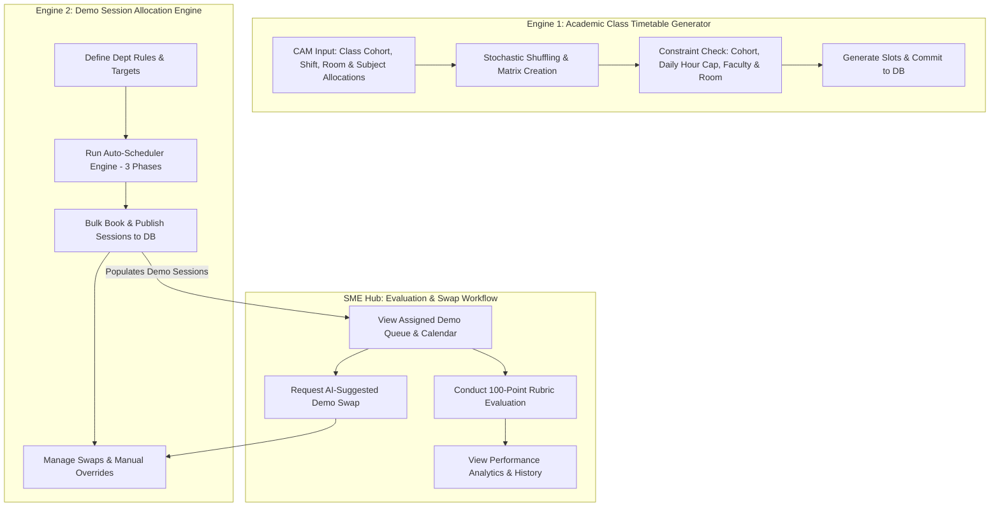
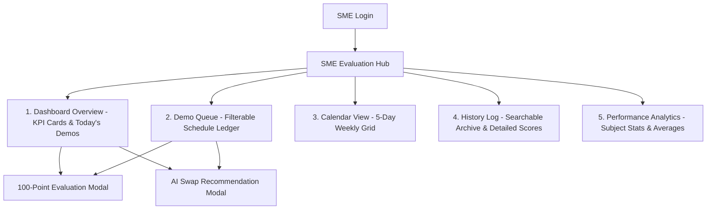

# Master System Guide: Timetable Generation, SME Dashboard & Allocation Dashboard Flows

> **System Source Files**:
> - [AppContext.tsx](file:///f:/FP%20time%20table%20system/src/context/AppContext.tsx#L1836-L2031) — Core Academic Timetable Generator (`generateTimetable`)
> - [CAMDashboard.tsx](file:///f:/FP%20time%20table%20system/src/components/CAMDashboard.tsx#L2875-L3050) — CAM Subject & Faculty Allocation Wizard
> - [SMEDashboard.tsx](file:///f:/FP%20time%20table%20system/src/components/SMEDashboard.tsx) — SME Evaluation Hub & Demo Management UI
> - [DemoAllocationDashboard.tsx](file:///f:/FP%20time%20table%20system/src/components/DemoAllocationDashboard.tsx#L411-L765) — Demo Evaluation Scheduler Engine (`runSchedulerEngine`) & Campus Management Hub

---

## 1. System Architecture & End-to-End Interconnection

---

## 2. Academic Class Timetable Generator (`generateTimetable`)

### 2.1 Workflow & SME/Faculty Allocation Setup
1. **Selection**: Campus Manager (CAM) specifies Course (e.g. *B.Tech CS*), Semester (e.g. *Sem 3*), Shift (*Shift 1 / Shift 2 / General*), and Default Room.
2. **Auto Faculty Matching**: System matches subjects to faculty mentors (`collegeMentors`) whose teaching subjects match (`isSubjectNameMatch`).
3. **Manual Overrides**: CAM can adjust weekly hours, assign custom rooms, or quick-add temporary subjects before launching generation.

### 2.2 Algorithm Execution Steps
- **Step 1: Workload List Build**: Creates `subjectsToAllocate` list tracking `hoursLeft` per subject.
- **Step 2: Stochastic Shuffling**:
  - Shuffles `subjectsToAllocate` using `shuffleArray()`.
  - Builds all possible `(Day, TimeSlot)` grid pairs across the 5-day week and shuffles them randomly to prevent fixed-order schedule bias.
- **Step 3: Constraint Enforcement Loop**:
  For each `(Day, TimeSlot)` pair, candidate subjects are evaluated in round-robin order:
  - **Cohort Availability**: Class cohort must not already have a slot at `(Day, TimeSlot)`.
  - **Daily Hour Cap**: Restricts a subject to max $\max(1, \lceil \text{weeklyHours} / 5 \rceil)$ slots per day.
  - **Faculty Physical Constraint**: Mentor cannot teach another class anywhere across the campus/shift at `(Day, TimeSlot)`.
  - **Room Physical Constraint**: Assigned classroom cannot be occupied by another class at `(Day, TimeSlot)`.
- **Step 4: Slot Placement**: Places slot, decrements `hoursLeft`, and updates daily placement counters.
- **Step 5: Preview & Persistence**:
  - `previewOnly = true`: Renders interactive grid modal and reports any unscheduled hours.
  - `previewOnly = false`: Clears previous cohort slots (`DELETE /api/slots`) and saves newly generated slots (`POST /api/slots/bulk`).

---

## 3. SME Dashboard (`SMEDashboard.tsx`) — Full Flow

### 3.1 Overview & Navigation Tabs
The SME Dashboard provides Subject Matter Experts (SMEs) with a complete evaluation hub structured across **5 Main Tabs**:

- **Dashboard Overview**: 6 KPI cards (Today's Demos, Pending, Completed, Swap Requests, Avg Score, This Week), Today's Demos quick-action feed, Upcoming Demos feed, and Internal Swap Approvals widget.
- **Demo Queue**: Filter bar (College, Subject, Status [Scheduled/Completed], Date, and Search) + full interactive table.
- **Calendar View**: 5-day weekly grid (Mon–Fri) with color-coded status badges.
- **History Log**: Searchable list of completed evaluations with expandable breakdown cards.
- **Performance Analytics**: Visual subject-wise average score breakdown and evaluation metrics.

---

### 3.2 Standardized 100-Point Evaluation Form

SMEs evaluate mentors using a strict **100-Point Rubric**:

| # | Evaluation Criterion | Max Marks | Description |
|---|---|---|---|
| 1 | **Attendance** | 5 | Punctuality & session start adherence |
| 2 | **Subject Knowledge** | 15 | Depth of domain understanding & accuracy |
| 3 | **Teaching Methodology** | 15 | Clarity of instruction & pedagogical technique |
| 4 | **Communication Skills** | 10 | Articulation, tone, and language clarity |
| 5 | **Technical Skills** | 15 | Tool proficiency & domain application |
| 6 | **Student Interaction** | 10 | Audience engagement & responsiveness |
| 7 | **Classroom Management** | 10 | Pace control & structural organization |
| 8 | **Question Handling** | 10 | Ability to resolve queries and handle doubts |
| 9 | **Time Management** | 5 | Adherence to session duration |
| 10 | **Overall Remarks** | 5 | Final qualitative assessment score |
| **Total** | **100 Marks** | **100** | **Calculated dynamically via `useMemo`** |

- **Duplicate Prevention**: If a session status is already `"completed"`, clicking **Evaluate** opens a read-only viewer (`viewEvalSession`).
- **Submission**: Validates `comments.trim() > 0` and total score before invoking `evaluateDemoSession(id, marks, comments)`.

---

### 3.3 AI-Powered Demo Swap Engine (`getSwapRecommendations`)

SMEs can request schedule swaps via two modes:

#### Mode A: Proxy Mentor Swap (`swapTab === "mentor"`)
Ranks candidate proxy mentors by calculating match score:
- `+25` Same Mentor Group match.
- `+15` Same Subject match.
- `+20` Free Slot availability.
- `+15` Lower weekly workload (`Math.max(0, 15 - weeklyLoad * 5)`).
- `+10` No consecutive class clash.
- `+5` Regular working shift hours.
- `+10` Same college assignment.

#### Mode B: Time / Date Swap (`swapTab === "time"`)
Scans alternative time slots on the current week:
- Verifies date is **not a holiday**.
- Verifies Mentor is **free** (no class, demo, or leave).
- Verifies SME is **free** (`isSmeBusy === false`).
- Verifies Mentor daily load `< 2/day`.
- Scores slot higher if it falls in standard shift hours (`+5`) and has no consecutive clash (`+10`).

---

## 4. Demo Session Scheduler Engine (`DemoAllocationDashboard.tsx`)

### 4.1 Hard Constraints (Mandatory Rules)

| Rule # | Rule Name | Condition & Enforcement Logic |
|---|---|---|
| **1** | **No Holiday Scheduling** | Dates in `holidays` are completely excluded. |
| **2** | **SME Leave Check** | SME must not have an approved leave on `dateStr` (`leaveRequests`). |
| **3** | **SME Slot Availability** | SME must be free (`isSmeFree`) with no existing DB session or generated demo at `(dateStr, timeSlot)`. |
| **4** | **Mentor Availability** | Mentor must be free (`getMentorStatusAtSlot`) — no regular class timetable slot, no leave, no demo session. |
| **5** | **Cohort Stream Availability** | The student group stream (`isGroupFree`) must not have a regular class or another demo session at `(dateStr, timeSlot)`. |
| **6** | **Stream Clash Prevention** | No two demos for the same cohort stream can occur simultaneously (`hasGroupDemoClash`). |
| **7** | **Subject Competency Match** | `sme.subject` must match the required `subjectGroup` (`mentor_group`). |
| **8** | **Daily Load Limits** | Max **2 demos per day** for SMEs (`smeDailyLoad < 2`). Max **1 demo per day** for Mentors in Phase 1, relaxed to **2 per day** in Phase 2 & 3. |
| **9** | **Hard Consecutive Period Cap** | Neither Mentor nor SME can have **3 consecutive busy periods** (`checkConsecutiveHardClash`). |

---

### 4.2 3-Phase Execution Strategy

#### Phase 1: Optimal Standard Spread
- **Time Slots**: Standard shift hours (`collegeTimeSlots` excluding lunch/break).
- **Daily Cap**: **Strictly 1 demo per mentor per day** (`mentorDailyLoad < 1`).

#### Phase 2: Standard Hours Density Shift
- **Trigger**: Any demands remaining after Phase 1.
- **Time Slots**: Standard shift hours.
- **Daily Cap**: **Relaxed to max 2 demos per mentor per day** (`mentorDailyLoad < 2`).

#### Phase 3: Beyond-Hours Fallback (Last Resort)
- **Trigger**: Any demands remaining after Phase 2.
- **Time Slots**: All evaluation slots, including non-standard slots (early morning/evening).
- **Penalty**: Heavy score penalty (**-35 points**) applied to avoid non-standard hours unless necessary.

---

### 4.3 Dynamic Scoring Formula & Weights Table

$$\text{Score} = S_{\text{base}} + S_{\text{mentor\_load}} + S_{\text{sme\_load}} + S_{\text{day\_spread}} + S_{\text{slot\_spread}} + S_{\text{match}} - P_{\text{prev}} - P_{\text{consec}} - P_{\text{beyond}} + \epsilon$$

| Metric | Score Weight | Rationale / Mathematical Rule |
|---|---|---|
| **Base Group Free** | `+30` | Reward for placing in a verified free cohort slot. |
| **Mentor Weekly Load** | `+0` to `+25` | `Math.max(0, 25 - (mentorWeeklyLoad * (25 / targetDemosCount)))`. Prioritizes mentors with fewer scheduled demos. |
| **SME Weekly Load** | `+0` to `+20` | `Math.max(0, 20 - (smeWeeklyLoad * 4))`. Balances teaching load evenly among available SMEs. |
| **Day Load Balancing** | `+0` to `+15` | `Math.max(0, 15 - (dayLoad * 3))`. Prefers days with lower overall campus demo density. |
| **Slot Load Balancing** | `+0` to `+10` | `Math.max(0, 10 - (slotLoad * 2))`. Spreads sessions evenly across time periods. |
| **Subject Exact Match** | `+5` | Extra bonus for exact normalized subject string match. |
| **Rotation Penalty** | `-25` | Applied if candidate slot `(mentorId, dateStr, timeSlot)` was used in previous schedule run to encourage schedule rotation. |
| **Soft Consecutive Penalty** | `-15` | Applied if slot creates back-to-back (2 consecutive) busy periods for either SME or Mentor (`checkHasSingleConsecutive`). |
| **Beyond-Hours Penalty** | `-35` | Applied in Phase 3 if `timeSlot` is outside standard shift hours. |
| **Tie-Breaker Noise** | `+0.00` to `+0.01` | Micro-random float (`Math.random() * 0.01`) to break exact score ties unpredictably. |

---

### 4.4 Live Re-allocation & Swap Validator (`validateProposedSwap`)

When an SME or Mentor requests a schedule swap via the dashboard, the request is real-time validated before execution:

#### Mentor Swap (`swapType === "mentor"`)
- Proposed Mentor must be **free** at target `(dateStr, timeSlot)`.
- Proposed Mentor's daily load must be `< 2/day`.
- Proposed Mentor must not exceed hard consecutive limit (3 consecutive busy slots).

#### Time Swap (`swapType === "time"`)
- Proposed date must not be a **holiday**.
- Mentor, SME, and Group Stream must **all be free** at proposed `(proposedDateStr, proposedTimeSlot)`.
- Mentor and SME daily load must be `< 2/day` on proposed date.
- Neither Mentor nor SME can exceed hard consecutive limit (3 consecutive busy slots).

---

## 5. Consolidated Feature Comparison Matrix

| Feature / Module | Academic Class Timetable (`generateTimetable`) | SME Evaluation Hub (`SMEDashboard`) | Demo Allocation Hub (`DemoAllocationDashboard`) |
|---|---|---|---|
| **Primary Target** | Weekly Cohort Class Schedule | SME Faculty Evaluations & Rubrics | Campus Demo Scheduling & Management |
| **Primary User Role** | Campus Manager (CAM) | Subject Matter Expert (SME) | Campus Manager / System Admin |
| **Core Algorithm** | Stochastic Round-Robin Loop | AI Swap Recommendation Engine | 3-Phase Multi-Factor Greedy Engine |
| **Daily Load Limits** | $\max(1, \lceil \text{hours} / 5 \rceil)$ per subject | Displays daily session count | Hard Limit: Max 2 demos/day per SME & Mentor |
| **Evaluation Form** | N/A | 100-Point 10-Criteria Standard Rubric | N/A |
| **Swap Requests** | N/A | Internal Approvals & AI Swap Modal | System-Wide Pre-validated Approval Hub |
