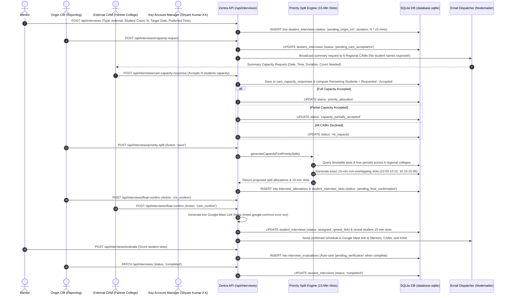

# Zentra E-Campus — Capacity-First External Interview Architecture & Request Flow

This document details the complete end-to-end flow for **Capacity-First External Interviews** across Zentra's 6 regional partner campuses, including early CAM capacity acceptance (without student names), priority-based regional allocation, 15-minute per student non-overlapping slot generation, time slot overflow cascading, deferred Google Meet link generation, and full status state machine management.

---

## 1. Capacity-First Sequence Diagram



---

## 2. Regional Partner Colleges & Datasets (KAM: Shyam Kumar A K)

| College ID | College Name | Campus Manager (CAM) | Department | Active Mentors | 3rd Year Students | Timetable Slots |
| :--- | :--- | :--- | :--- | :---: | :---: | :---: |
| `college_sdnb` | **SDNB Vaishnav College for Women** | Greeta Paulin S (`cam_greeta`) | B.Sc. CS & AI | 32 | 34 | 380 |
| `Clg_c` | **Kamaraj College of Eng. & Tech.** | Kamaraj CM (`cam_kamaraj`) | B.E. CSE | 26 | 39 | 307 |
| `col_loyola` | **Loyola Institute of Technology** | Dr. Suresh Raman (`cam_loyola`) | B.Tech AI & DS | 4 | 25 | 40 |
| `col_ssn` | **SSN College of Engineering** | Dr. Kavitha Sundaram (`cam_ssn`) | B.E. CSE | 4 | 25 | 40 |
| `col_testing` | **Zentra Autonomous Campus** | Mounika Rathinasamy (`cam_mounika`) | B.Tech IT | 2 | 25 | 30 |
| `col_srm` | **SRM Institute of Science & Tech.** | Arun Kumar (`cam_srm`) | B.Tech CSE | 4 | 50 | 80 |

---

## 3. Core Architecture Rules & Implementation Details

### 1. 15-Minute per Student Slot Rule
* Each student is allocated **exactly one 15-minute non-overlapping interview slot**.
* $$\text{Total Required Duration} = \text{Student Count} \times 15\text{ minutes}$$
* *Example*: $20\text{ students} \times 15\text{ mins} = 300\text{ minutes (5 hours)}$.
* Slots are generated chronologically: `10:00–10:15`, `10:15–10:30`, `10:30–10:45`, `10:45–11:00`.

### 2. Progressive Student Details Hiding
* **Before CAM Capacity Acceptance**: CAMs see summary information only: Request ID, Subject, Target Date, Preferred Time, Total Students Needed, Required Duration. **No student names or personal records are exposed**.
* **After Priority Allocation**: Allocated student lists are prepared for confirmed colleges.
* **After Final Confirmation**: Student names, assigned mentors, 15-minute slot times, and Google Meet link are fully revealed.

### 3. Capacity Math Checks
At all times, the system dynamically maintains:
$$\text{Remaining Students} = \text{Total Requested Students} - \text{Total Accepted Capacity}$$
$$\text{Unallocated Students} = \text{Total Requested Students} - \text{Allocated Students}$$
If a CAM accepts partial capacity (e.g. 6 out of 20 students), the request moves to `capacity_partially_accepted` and remaining students ($14$) stay active in the pool.

### 4. Deferred Google Meet Link Generation
* Google Meet links are **NOT** generated during request creation or initial capacity acceptance.
* Google Meet links are generated **strictly after final CAM confirmation** ([final-confirm/route.ts](file:///f:/FP%20time%20table%20system/src/app/api/interviews/final-confirm/route.ts#L40)).

---

## 4. Complete Status State Machine Summary

```text
draft
   ↓
pending_origin_cm
   ↓
pending_cam_acceptance
   ↓
capacity_partially_accepted  (or priority_allocation if full)
   ↓
pending_final_confirmation
   ↓
assigned
   ↓
in_progress
   ↓
pending_verification
   ↓
completed
```

### Exception States:
* `no_capacity`: All regional CAMs declined or no mentor capacity is available.
* `declined`: An actual rejection of capacity or final allocation.
* `cancelled`: Request cancelled by reporting CM or mentor.
* `expired`: Target date passed without capacity acceptance.
