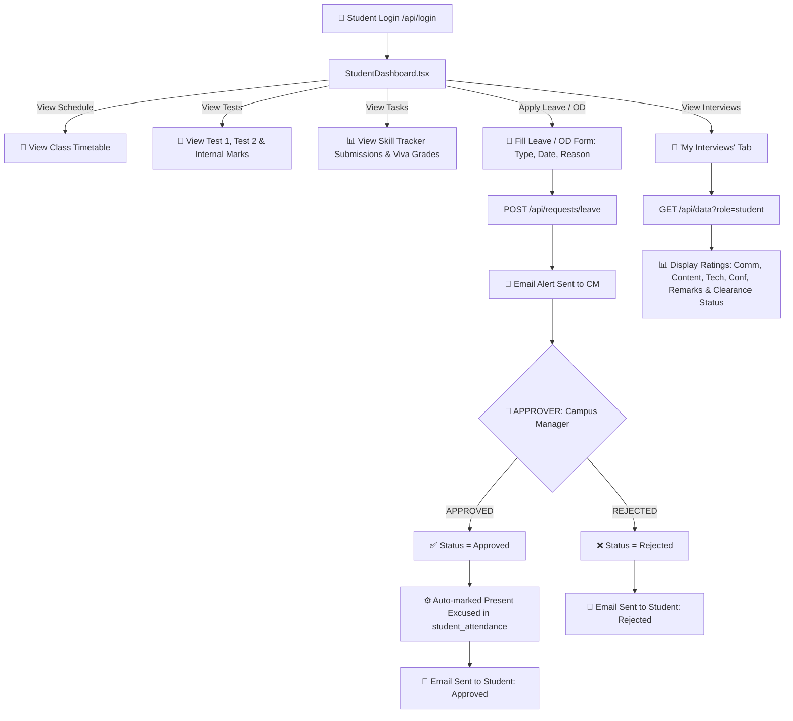
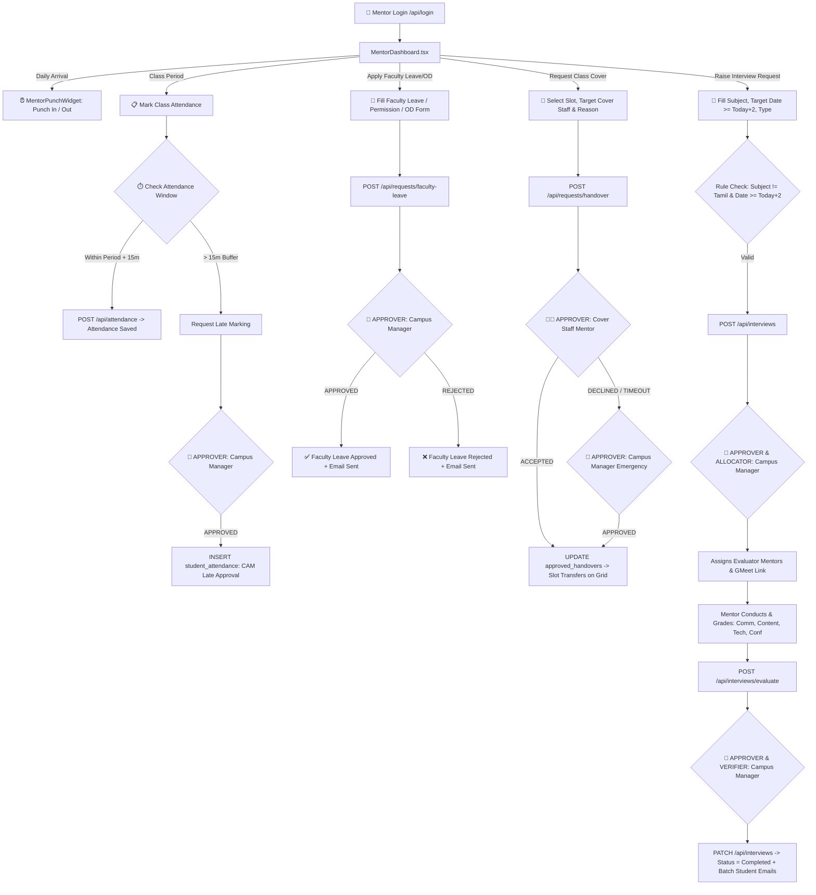
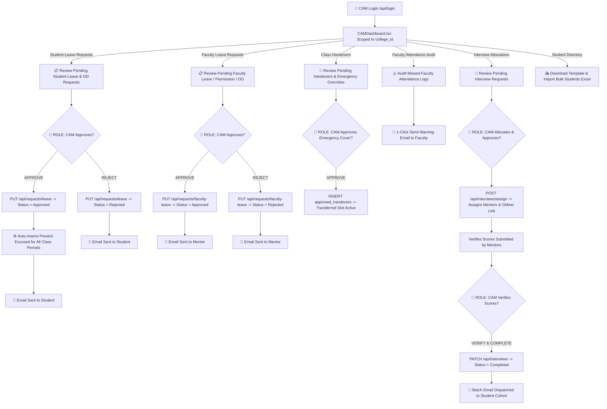
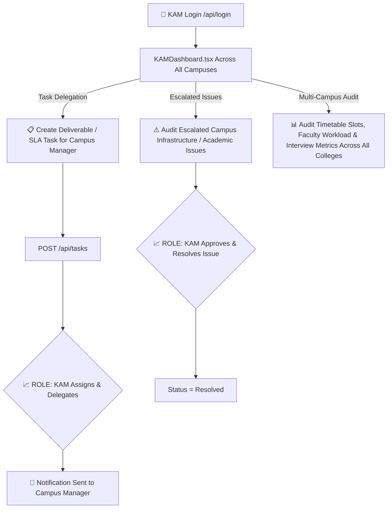
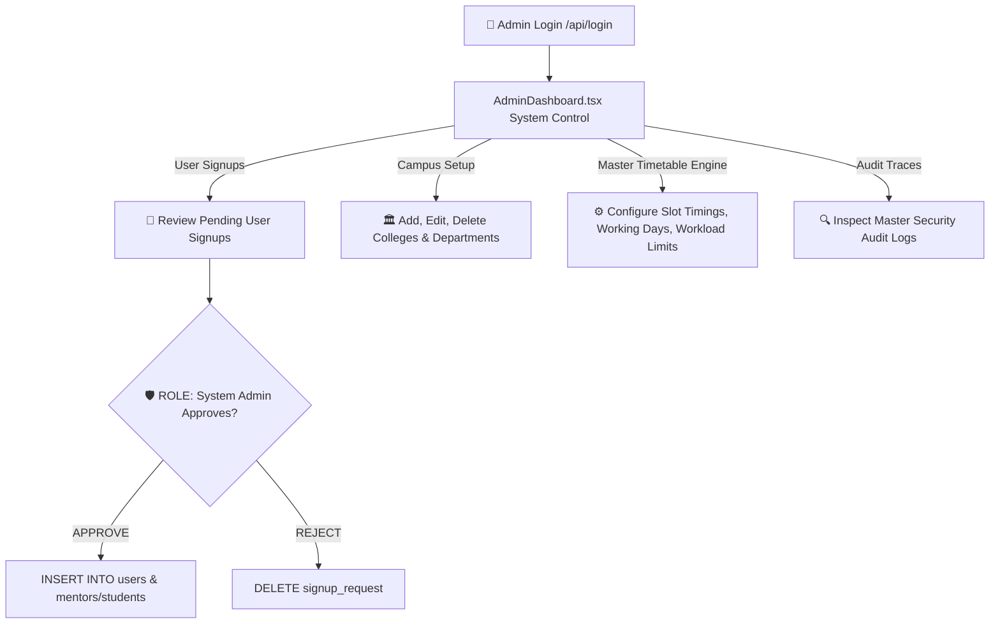

# 📊 Zentra Role-by-Role Flowcharts & Approval Authorities

This document contains **pure visual flowcharts** for each of the 5 login roles, explicitly highlighting **WHO APPROVES** each action.

---

# 🎓 1. STUDENT ROLE FLOWCHART

---

# 👨‍🏫 2. FACULTY MENTOR ROLE FLOWCHART

---

# 🏢 3. CAMPUS MANAGER (CAM / CM) ROLE FLOWCHART

---

# 📈 4. KEY ACCOUNT MANAGER (KAM) ROLE FLOWCHART

---

# 🛡️ 5. SYSTEM ADMIN ROLE FLOWCHART

---

## 🏛️ 6. Quick Approval Authority Reference Table

| Action / Workflow | Requesting Role | 🎯 WHO APPROVES? | API Endpoint Used | Result / Side-Effect |
| :--- | :--- | :--- | :--- | :--- |
| **Student Leave / OD** | 🎓 Student | 🏢 **Campus Manager (CAM)** | `PUT /api/requests/leave` | Auto-excuses class attendance as `present` + Sends decision email. |
| **Faculty Leave / OD / Permission** | 👨‍🏫 Mentor | 🏢 **Campus Manager (CAM)** | `PUT /api/requests/faculty-leave` | Approves leave + Sends decision email to mentor. |
| **Class Handover (Regular)** | 👨‍🏫 Mentor A | 👨‍🏫 **Cover Staff Mentor B** | `PUT /api/requests/resolve` | Slot transfers responsibility to Mentor B on timetable grid. |
| **Class Handover (Emergency)** | 👨‍🏫 Mentor A | 🏢 **Campus Manager (CAM)** | `PUT /api/requests/resolve` | Emergency CAM override transfers slot responsibility. |
| **Late Attendance Punch (>15m)** | 👨‍🏫 Mentor | 🏢 **Campus Manager (CAM)** | `Academic Monitoring` | CAM approves late period attendance marking. |
| **Interview Request Creation** | 👨‍🏫 Mentor | 🏢 **Campus Manager (CAM)** | `POST /api/interviews` | Validates date (≥ +2 days, non-Tamil), alerts CM via email. |
| **Interview Allocation & GMeet** | 🏢 CAM | 🏢 **Campus Manager (CAM)** | `POST /api/interviews/assign` | Assigns evaluator mentors and GMeet link to session. |
| **Interview Score Verification** | 🏢 CAM | 🏢 **Campus Manager (CAM)** | `PATCH /api/interviews` | Verifies score ratings, marks completed, sends batch student emails. |
| **KAM Deliverables & Tasks** | 📈 KAM | 📈 **Key Account Manager (KAM)** | `POST /api/tasks` | Creates task assigned to Campus Manager. |
| **User Signups & System Setup** | 👥 User | 🛡️ **System Admin** | `Admin Panel` | Approves user signup requests and initializes credentials. |
